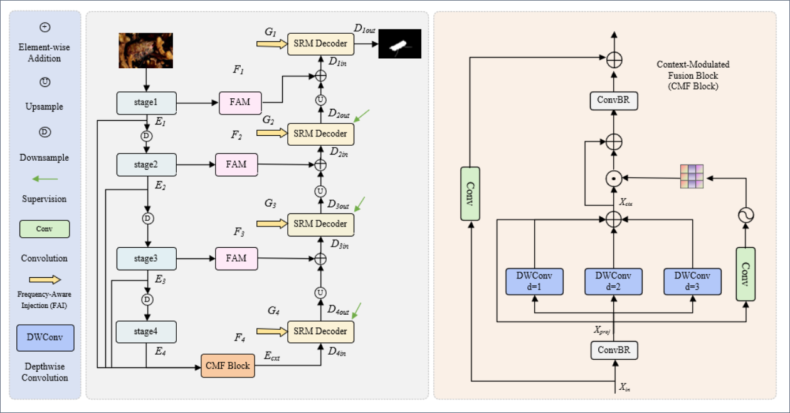

# FGMNet: Frequency-Guided Gated Mamba Network for Camouflaged Object Detection

Official PyTorch implementation of the paper: **"FGMNet: Frequency-Guided Gated Mamba Network for Camouflaged Object Detection"**.

[[paper]() [[visual results](https://pan.baidu.com/s/1_AD2O0q8ZAgbs_N5lXUs7w?pwd=y3v4)] [[weights](https://pan.baidu.com/s/11gHxkJErBCuPBtr6ZIbowA?pwd=m2gg)]

---

## 📝 Abstract

Camouflaged Object Detection (COD) remains highly challenging due to the extreme visual similarity between targets and backgrounds, which often causes severe boundary ambiguity and incomplete structure recovery. To address these issues, we propose a novel Frequency-Guided Gated Mamba Network (FGMNet), which integrates frequency-domain priors with efficient state-space sequence modeling for accurate pixel-level segmentation. Specifically, a Feature Aggregation Module (FAM) is designed to enhance local structural perception by adaptively capturing isotropic and anisotropic spatial cues. To preserve fine boundary details lost during backbone downsampling, we design a Frequency-Aware Injection (FAI) module that extracts multi-scale high-frequency information via discrete wavelet transform and injects it into the decoding hierarchy. In addition, a Context-Modulated Fusion (CMFusion) block is developed to suppress background clutter and establish robust global semantic context. For long-range dependency modeling, we propose a Scan Routing Mamba (SRM) decoder that dynamically routes features between bidirectional axial and rotation-aware scanning paths, enabling comprehensive omnidirectional sequence reasoning to preserve seamless topological continuity. Extensive experiments on four COD benchmarks and five polyp segmentation datasets demonstrate that FGMNet consistently outperforms state-of-the-art methods, achieving superior boundary precision, structural consistency, and strong generalization capability.

---

## 🗺️ Network Architecture



Architectural layout of the proposed Frequency-Guided Gated Mamba Network (FGMNet). The left panel illustrates the overall framework of the network, which includes the Feature Aggregation Module (FAM), Frequency-Aware Injection (FAI), and the Scan Routing Mamba (SRM) Decoder. The right panel depicts the detailed architecture of the Context-Modulated Fusion (CMF) block.

---

## 🚀 Repository Structure

```text
FGM/
├── images/
│   └── fgm.png             # Network architecture layout figure
├── README.md               # Project documentation
├── dataset/                # Place COD10K, NC4K, CAMO, SBU datasets here
├── models/                 # Model definitions (FGMNet, SRM, FAM, FAI, CMFusion)
├── utils/                  # Loss functions, evaluation metrics, and transforms
├── train.py                # Training script
└── test.py                 # Evaluation and inference script
```

---

## 🔧 Installation & Environment

We recommend managing the runtime environment using **Conda**.

```bash
# Create a new environment
conda create -n fgmnet python=3.10 -y
conda activate fgmnet

# Install PyTorch (adjust CUDA version based on your GPU hardware, e.g., RTX 3090)
conda install pytorch torchvision torchaudio pytorch-cuda=11.8 -c pytorch -c nvidia

# Install dependencies for Mamba blocks
pip install causal-conv1d>=1.4.0
pip install mamba-ssm

# Install other requirements
pip install timm opencv-python scikit-image thop
```

---

## 🏋️ Quick Start

### 1. Training
To train FGMNet on COD benchmarks:
```bash
python train.py --batch_size 16 --lr 1e-4 --dataset_path ./dataset/train/
```

### 2. Testing & Evaluation
To test the trained model and generate saliency maps:
```bash
python test.py --model_path ./checkpoints/fgmnet_best.pth --dataset_path ./dataset/test/
```

### 3. Inference Results

- Download our inference results: [[Inference Results](https://pan.baidu.com/s/1_AD2O0q8ZAgbs_N5lXUs7w?pwd=y3v4)]

After downloading, place the extracted prediction maps under a directory such as `./results/`. These results can be used for qualitative comparison, metric evaluation, or reproducing the visual examples reported in the paper.
